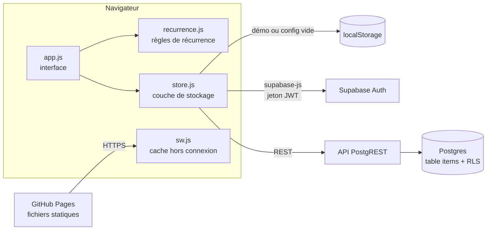

# Semainier

Planning personnel en vue semaine, pensé comme une page de cahier : on y **bloque des créneaux** et on y **coche des tâches récurrentes** qui se remettent à zéro chaque jour, chaque semaine ou chaque mois.

[](https://cadgeff.github.io/Planning/#demo)


[](LICENSE)

**[→ Essayer la démo](https://cadgeff.github.io/Planning/#demo)**, sans compte, avec des données d'exemple stockées dans votre navigateur.


## Pourquoi ce projet

Les outils de planning grand public couvrent soit l'agenda (Google Calendar), soit les listes de tâches (Todoist, Trello), rarement les deux dans une même vue. Il me fallait une page unique pour organiser mes journées en *time blocking* : poser des blocs de travail dans la semaine, avec à côté les tâches qui reviennent (tous les jours, certains jours de la semaine, une fois par mois) et que je coche au fil de l'eau.

J'ai aussi voulu garder la main sur toute la chaîne. Le code, les polices et les bibliothèques sont dans ce dépôt. Les seules briques externes sont l'hébergement statique et une base Postgres, remplaçables toutes les deux.

## Fonctionnalités

- **Vue semaine** sur une grille au quart d'heure, et **vue jour** sur mobile.
- **Créneaux bloqués** : un clic sur une case vide crée un créneau à cette heure, avec un aperçu au survol.
- **Tâches à cocher**, avec ou sans heure. Les tâches sans heure vont dans la ligne « À faire » du jour.
- **Récurrence** quotidienne, hebdomadaire (jours au choix) ou mensuelle. Le 31 retombe sur le dernier jour des mois courts.
- **Cocher ne vaut que pour le jour même** : l'occurrence suivante revient vierge. On peut aussi retirer un seul jour d'une série sans toucher au reste.
- **Repères visuels** : jours passés atténués, colonne du jour, ligne de l'heure actuelle, compteur des tâches du jour.
- **Raccourcis clavier** : <kbd>←</kbd> <kbd>→</kbd> pour changer de semaine, <kbd>T</kbd> pour aujourd'hui, <kbd>N</kbd> pour un nouvel élément.
- **Export et import JSON** pour sauvegarder ou migrer ses données.
- **Application installable (PWA)** : icône sur l'écran d'accueil, ouverture hors connexion, thème clair ou sombre selon le système.

| Mode sombre | Mobile |
|---|---|
|  |  |

## Stack technique

| Couche | Choix | Pourquoi |
|---|---|---|
| Interface | HTML, CSS et JavaScript natifs, sans framework ni build | Le projet tient en quelques fichiers lisibles, se déploie tel quel et n'a aucune dépendance à maintenir. |
| Données et authentification | [Supabase](https://supabase.com) : Postgres, Auth, API REST | Postgres standard et open source, sécurisé par Row Level Security, exportable avec `pg_dump`, auto-hébergeable. |
| Hébergement | GitHub Pages | Site statique gratuit, déployé à chaque push. |
| Hors connexion | Service worker, stratégie « réseau d'abord » | Toujours la dernière version en ligne, et l'interface s'ouvre quand même sans réseau. |
| Ressources | `supabase-js` et polices copiés dans le dépôt | Aucun CDN tiers : pas de fuite d'adresse IP vers Google Fonts, pas de dépendance à la disponibilité d'un CDN. |

## Architecture



**Une règle, pas des occurrences.** La base stocke chaque élément une seule fois, avec sa règle de répétition. Les occurrences sont calculées à l'affichage par `recurrence.js`, un module de fonctions pures couvert par des tests. Deux tableaux JSON par élément gardent les exceptions : `done`, pour les jours cochés, et `skipped`, pour les jours retirés de la série.

**Trois modes, une interface.** `store.js` expose la même interface (`list`, `save`, `remove`…) derrière trois implémentations : Supabase en production, `localStorage` pour la démo publique (`#demo`), et un mode local quand `config.js` est vide. L'interface ne sait pas où vont les données.

### Modèle de données

| Colonne | Type | Rôle |
|---|---|---|
| `id` | `uuid` | Identifiant généré côté client, pour que l'import et la création soient rejouables sans doublon |
| `user_id` | `uuid` | Propriétaire, rempli par défaut avec `auth.uid()` |
| `kind` | `text` | `block` (créneau bloqué) ou `task` (tâche à cocher) |
| `start_date` | `date` | Première occurrence |
| `time_from`, `time_to` | `time` | Horaires : les deux ou aucun, et la fin après le début |
| `recur` | `text` | `none`, `daily`, `weekly` ou `monthly` |
| `days` | `smallint[]` | Jours actifs en hebdomadaire, de 0 (lundi) à 6 (dimanche) |
| `done`, `skipped` | `jsonb` | Occurrences cochées ou retirées : `{ "AAAA-MM-JJ": true }` |

Toutes ces contraintes sont vérifiées par Postgres lui-même (voir [`supabase/schema.sql`](supabase/schema.sql)).

## Sécurité

Le dépôt est public et la clé Supabase est visible dans le navigateur, comme dans toute application front-end. La sécurité repose donc entièrement sur le serveur :

- **Row Level Security** sur la table `items` : chaque requête est filtrée par `auth.uid() = user_id`, en lecture comme en écriture. Un utilisateur authentifié ne peut ni lire, ni modifier, ni s'approprier la ligne d'un autre. Le rôle `anon` n'a aucun droit sur la table.
- **Inscriptions désactivées** : le seul compte est créé à la main dans le tableau de bord Supabase.
- **Seule la clé publishable est exposée.** L'application refuse de démarrer en mode Supabase si `config.js` contient une clé à privilèges (`sb_secret_…` ou `service_role`).
- **Content Security Policy** stricte : scripts, styles et polices servis uniquement par le site, requêtes réseau limitées à `*.supabase.co`, pas de `<base>`, de formulaire externe ni d'objet embarqué.
- **Contraintes SQL** sur chaque colonne : énumérations, cohérence des horaires, longueur des titres, forme des objets JSON.
- **Entrées non fiables** : les imports JSON sont revalidés champ par champ et tout le texte affiché est échappé.
- **Pas de tiers** : ni CDN, ni polices distantes, ni outil d'analyse d'audience. En-tête `no-referrer`.

## Installer sa propre instance

### 1. Base de données

1. Créer un projet sur [supabase.com](https://supabase.com), de préférence dans une région européenne.
2. Dans **SQL Editor**, exécuter [`supabase/schema.sql`](supabase/schema.sql). Le script est idempotent : on peut le relancer sans risque.
3. Dans **Authentication → Sign In / Providers**, désactiver *Allow new users to sign up*.
4. Dans **Authentication → Users → Add user**, créer son compte en cochant *Auto Confirm User*.

### 2. Configuration

Récupérer l'URL du projet et la clé **publishable** (bouton **Connect** du projet, ou **Project Settings → API Keys**), puis les renseigner dans `config.js` :

```js
window.SEMAINIER_CONFIG = {
  supabaseUrl: "https://<identifiant-du-projet>.supabase.co",
  supabaseKey: "sb_publishable_…"
};
```

### 3. Déploiement

Pousser le dépôt sur GitHub, puis activer **Settings → Pages → Deploy from a branch → `main` / `(root)`**. L'application est servie à `https://<utilisateur>.github.io/<dépôt>/`.

N'importe quel hébergeur de fichiers statiques convient (Netlify, Cloudflare Pages, un simple nginx). Si Supabase est auto-hébergé sur un autre domaine, il faut l'ajouter à `connect-src` dans la CSP de `index.html`.

## Développement

Aucune installation n'est nécessaire. Avec un `config.js` vide, l'application tourne en mode local :

```
python -m http.server 8000     # puis http://localhost:8000
node --test                    # tests de recurrence.js (Node 18+)
```

Après avoir ajouté ou renommé un fichier servi, mettre à jour la liste `SHELL` dans `sw.js` et incrémenter `CACHE`.

## Structure

```
index.html            page unique, CSP
styles.css            thème clair et sombre, mise en page
app.js                interface : rendu, formulaires, raccourcis, synchronisation
recurrence.js         dates et règles de récurrence (fonctions pures)
store.js              stockage : Supabase, local ou démo
config.js             URL et clé publishable Supabase
sw.js                 service worker
manifest.webmanifest  installation sur l'écran d'accueil
supabase/schema.sql   table, contraintes, RLS
tests/                tests node:test
vendor/               supabase-js 2.117.2 (MIT)
fonts/                Bricolage Grotesque, Instrument Sans, IBM Plex Mono (SIL OFL)
icons/, docs/         icônes et captures
```

## Feuille de route

- [ ] Report automatique des tâches non faites au lendemain
- [ ] Vue mois
- [ ] Déplacer et redimensionner les créneaux à la souris
- [ ] Synchronisation en temps réel entre appareils (Supabase Realtime)
- [ ] Statistiques : temps bloqué par catégorie, régularité des tâches récurrentes

## Licence

Code sous licence [MIT](LICENSE). Polices sous licence SIL Open Font License, client `supabase-js` sous licence MIT (voir `fonts/` et `vendor/`).
