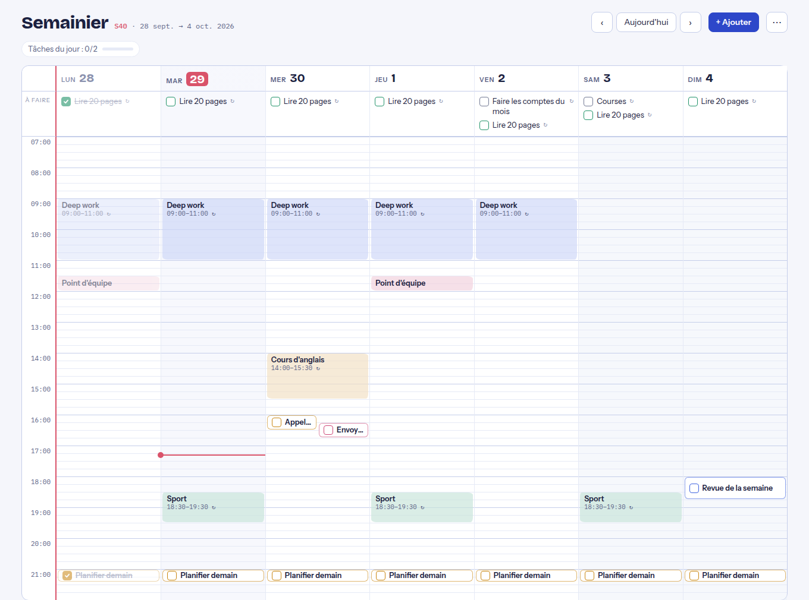
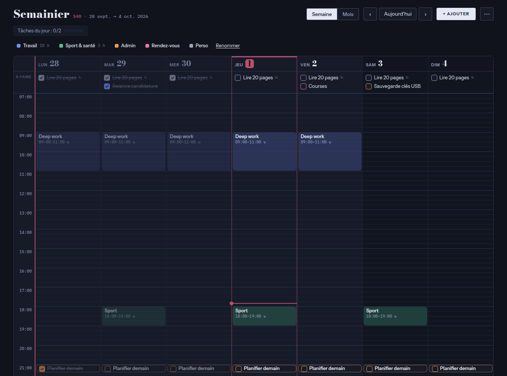
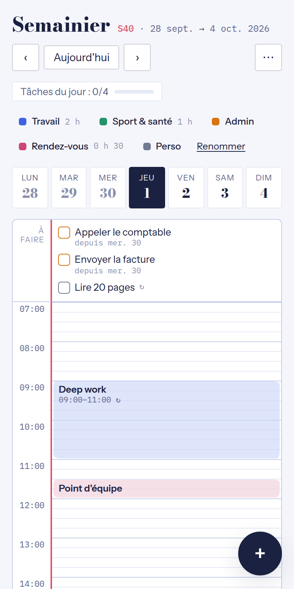
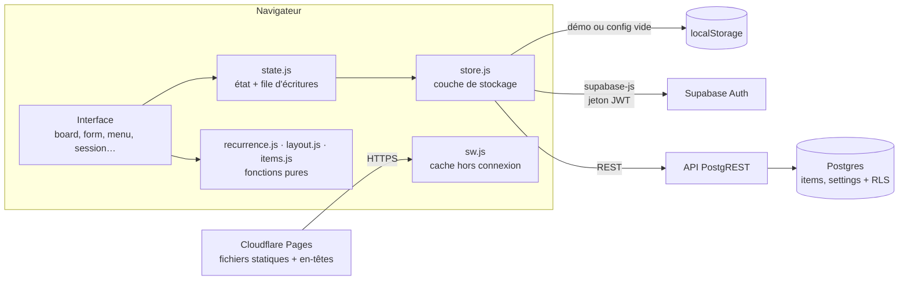

# Semainier

Planning personnel en vue semaine, pensé comme une page de cahier : on y **bloque des créneaux** et on y **coche des tâches récurrentes** qui se remettent à zéro chaque jour, chaque semaine ou chaque mois.

[](https://semainier-cadgeff.pages.dev/#demo)
[](https://github.com/CadGeff/semainier/actions/workflows/ci.yml)
[](https://securityheaders.com/?q=semainier-cadgeff.pages.dev&followRedirects=on)
[](#stack-technique)
[](#sécurité)
[](#fonctionnalités)
[](LICENSE)

**[→ Essayer la démo](https://semainier-cadgeff.pages.dev/#demo)**, sans compte, avec des données d'exemple stockées dans votre navigateur.



## Pourquoi ce projet

Les outils de planning grand public couvrent soit l'agenda (Google Calendar), soit les listes de tâches (Todoist, Trello), rarement les deux dans une même vue. Il me fallait une page unique pour organiser mes journées en *time blocking* : poser des blocs de travail dans la semaine, avec à côté les tâches qui reviennent (tous les jours, certains jours de la semaine, une fois par mois) et que je coche au fil de l'eau.

J'ai aussi voulu garder la main sur toute la chaîne. Le code, les polices et les bibliothèques sont dans ce dépôt. Les seules briques externes sont l'hébergement statique et une base Postgres, remplaçables toutes les deux.

## Fonctionnalités

- **Vue semaine** sur une grille au quart d'heure, et **vue jour** sur mobile.
- **Créneaux bloqués** : un clic sur une case vide crée un créneau à cette heure, avec un aperçu au survol.
- **Tâches à cocher**, avec ou sans heure. Les tâches sans heure vont dans la ligne « À faire » du jour.
- **Récurrence** quotidienne, hebdomadaire (jours au choix) ou mensuelle. Le 31 retombe sur le dernier jour des mois courts.
- **Cocher ne vaut que pour le jour même** : l'occurrence suivante revient vierge. On peut aussi retirer un seul jour d'une série sans toucher au reste.
- **Catégories nommées** (Travail, Sport & santé, Admin…) : la légende affiche le temps bloqué par catégorie sur la semaine, et un clic sur une catégorie efface les autres. Les noms sont modifiables et synchronisés entre appareils.
- **Repères visuels** : jours passés atténués, colonne du jour, ligne de l'heure actuelle, compteur des tâches du jour.
- **Thème Auto, Clair ou Sombre**, réglable sur chaque appareil. Auto suit le système.
- **Raccourcis clavier** : <kbd>←</kbd> <kbd>→</kbd> pour changer de semaine, <kbd>T</kbd> pour aujourd'hui, <kbd>N</kbd> pour un nouvel élément.
- **Export et import JSON** pour sauvegarder ou migrer ses données.
- **Double authentification (TOTP) optionnelle**, activable depuis le menu : QR code à scanner avec une application comme Aegis, puis code à 6 chiffres à chaque nouvelle connexion. Elle est imposée par la base de données, pas seulement par l'interface.
- **Application installable (PWA)** : icône sur l'écran d'accueil, ouverture hors connexion.

| Mode sombre | Mobile |
|---|---|
|  |  |

## Stack technique

| Couche | Choix | Pourquoi |
|---|---|---|
| Interface | HTML, CSS et JavaScript natifs (modules ES), sans framework ni build | Le code servi est le code écrit : lisible dans le navigateur, déployé tel quel, aucune dépendance d'exécution à maintenir. |
| Données et authentification | [Supabase](https://supabase.com) : Postgres, Auth, API REST | Postgres standard et open source, sécurisé par Row Level Security, exportable avec `pg_dump`, auto-hébergeable. |
| Hébergement | Cloudflare Pages | Site statique gratuit, déployé à chaque push, avec de vrais en-têtes HTTP de sécurité (`_headers`). |
| Hors connexion | Service worker, stratégie « réseau d'abord » | Toujours la dernière version en ligne, et l'interface s'ouvre quand même sans réseau. |
| Ressources | `supabase-js` et polices copiés dans le dépôt | Aucun CDN tiers : pas de fuite d'adresse IP vers Google Fonts, pas de dépendance à la disponibilité d'un CDN. |
| Qualité | ESLint, Prettier, TypeScript (JSDoc), `node:test`, Playwright, GitHub Actions | Outils de développement uniquement : rien de tout cela n'est envoyé au navigateur. |

## Architecture



**Une règle, pas des occurrences.** La base stocke chaque élément une seule fois, avec sa règle de répétition. Les occurrences sont calculées à l'affichage par `recurrence.js`, un module de fonctions pures couvert par des tests. Deux tableaux JSON par élément gardent les exceptions : `done`, pour les jours cochés, et `skipped`, pour les jours retirés de la série.

**Modules sans effet de bord.** Chaque module d'interface exporte une fonction `init…()` appelée par `app.js` : importer un module ne pose aucun écouteur et ne déclenche aucun rendu, ce qui rend l'ordre de démarrage explicite. La logique métier (récurrence, placement des créneaux, validation des imports, traduction des erreurs) vit dans des modules purs, testés sous Node sans navigateur.

**Trois modes, une interface.** `store.js` expose la même interface (`list`, `save`, `remove`…) derrière trois implémentations : Supabase en production, `localStorage` pour la démo publique (`#demo`), et un mode local quand `config.js` est vide. L'interface ne sait pas où vont les données.

### Modèle de données

| Colonne | Type | Rôle |
|---|---|---|
| `id` | `uuid` | Identifiant généré côté client, pour que l'import et la création soient rejouables sans doublon |
| `user_id` | `uuid` | Propriétaire, rempli par défaut avec `auth.uid()` |
| `kind` | `text` | `block` (créneau bloqué) ou `task` (tâche à cocher) |
| `start_date` | `date` | Première occurrence |
| `time_from`, `time_to` | `time` | Horaires : les deux ou aucun, et la fin après le début |
| `recur` | `text` | `none`, `daily`, `weekly` ou `monthly` |
| `days` | `smallint[]` | Jours actifs en hebdomadaire, de 0 (lundi) à 6 (dimanche) |
| `done`, `skipped` | `jsonb` | Occurrences cochées ou retirées : `{ "AAAA-MM-JJ": true }` |

Une seconde table, `settings`, contient une ligne par utilisateur avec les noms des catégories (`cat_labels`), sous la même RLS. Toutes ces contraintes sont vérifiées par Postgres lui-même (voir [`supabase/schema.sql`](supabase/schema.sql)).

## Sécurité

Le dépôt est public et la clé Supabase est visible dans le navigateur, comme dans toute application front-end. La sécurité repose donc entièrement sur le serveur :

- **Row Level Security** sur les tables `items` et `settings` : chaque requête est filtrée par `auth.uid() = user_id`, en lecture comme en écriture. Un utilisateur authentifié ne peut ni lire, ni modifier, ni s'approprier la ligne d'un autre. Le rôle `anon` n'a aucun droit sur ces tables.
- **Inscriptions désactivées** : le seul compte est créé à la main dans le tableau de bord Supabase.
- **Seule la clé publishable est exposée.** L'application refuse de démarrer en mode Supabase si `config.js` contient une clé à privilèges (`sb_secret_…` ou `service_role`).
- **Content Security Policy** stricte, envoyée en en-tête HTTP, **sans aucune exception `unsafe-inline`** : scripts, styles et polices servis uniquement par le site, aucun script, bloc `<style>` ni attribut `style=""` en ligne (les positions de la grille passent par le CSSOM), requêtes réseau limitées **au seul projet Supabase** de l'application (un script injecté ne pourrait pas exfiltrer vers un autre projet), pas de `<base>`, de formulaire externe ni d'objet embarqué.
- **En-têtes HTTP** (`_headers`) : HSTS, `frame-ancestors 'none'` et `X-Frame-Options` contre le clickjacking (doublés d'une vérification en JavaScript), `nosniff`, `Permissions-Policy` qui coupe caméra, micro, géolocalisation et paiement, isolation `Cross-Origin-Opener-Policy` / `Cross-Origin-Resource-Policy`. L'en-tête CORS ouvert qu'ajoute Cloudflare par défaut est retiré.
- **Double authentification optionnelle, vérifiée côté serveur** : quand un facteur TOTP est actif, une politique RLS *restrictive* exige un jeton de niveau `aal2` sur `items` et `settings`. Un mot de passe volé donne une session `aal1`, qui ne lit ni n'écrit rien, même en appelant l'API directement. La fonction de contrôle vit dans un schéma `private` non exposé par l'API.
- **Sessions** : changer de mot de passe ou activer la 2FA révoque les autres sessions ; « Se déconnecter » ferme la session sur tous les appareils.
- **Contraintes SQL** sur chaque colonne : énumérations, cohérence des horaires, longueur des titres, forme des objets JSON.
- **Entrées non fiables** : les imports JSON sont revalidés champ par champ et tout le texte affiché est échappé.
- **Pas de tiers** : ni CDN, ni polices distantes, ni outil d'analyse d'audience. En-tête `no-referrer`.
- **Vérifié automatiquement** : les tests de bout en bout contrôlent à chaque push les en-têtes, l'absence de violation de CSP, le blocage d'un script ou d'un style injecté, le refus d'affichage dans un cadre, l'échappement des titres et le parcours 2FA.

### Modèle de menace

Un planning semble anodin, mais il décrit **où l'on est et quand** : horaires de travail, séances de sport, rendez-vous, absences du domicile. C'est ce qui justifie le niveau de protection, et c'est aussi ce qui en fixe les limites : l'objectif est de rendre une attaque coûteuse, pas de résister à un attaquant étatique.

**Ce qu'on protège**

| Actif | Pourquoi |
|---|---|
| Les éléments du planning | Révèlent routines et absences : utiles pour un cambriolage ou une filature. |
| Le compte Supabase de l'application | Y accéder, c'est lire et modifier tout le planning. |
| Le compte GitHub et le tableau de bord Supabase | Permettraient de modifier le code servi ou les règles de la base. |

**Menaces et parades**

| Menace | Parade en place |
|---|---|
| Quelqu'un lit la clé dans le code source et interroge l'API | La clé publishable ne donne aucun droit : `anon` n'a rien sur les tables, RLS filtre chaque ligne par utilisateur. |
| Création d'un compte pour « entrer » dans l'application | Inscriptions fermées côté serveur. |
| Mot de passe deviné, réutilisé ou fuité | Mot de passe long et unique généré par un gestionnaire ; limitation des tentatives par Supabase ; 2FA optionnelle imposée par RLS. |
| Session restée ouverte sur un appareil perdu | Déconnexion globale, révocation des autres sessions au changement de mot de passe et à l'activation de la 2FA. |
| Injection de script (XSS) via un titre ou un import | Texte toujours échappé, imports revalidés, CSP sans script inline ni domaine tiers. |
| Exfiltration par un script injecté malgré tout | `connect-src` limité au seul projet Supabase de l'application. |
| Page affichée dans un cadre piégé (clickjacking) | `frame-ancestors 'none'` et `X-Frame-Options: DENY` ; refus en JavaScript en secours. |
| Bibliothèque compromise sur un CDN | Aucun CDN : `supabase-js` et les polices sont versionnés dans le dépôt. |
| Clé secrète commitée par erreur | L'application refuse de démarrer avec une clé `service_role` / `sb_secret_`, et GitHub bloque le push des secrets connus. |

**Pourquoi la 2FA est optionnelle**

Pour un outil ouvert plusieurs fois par jour, un code à chaque connexion est une friction réelle. La session reste ouverte sur les appareils de confiance, donc le code n'est demandé qu'à une nouvelle connexion ; la 2FA protège surtout contre un mot de passe compromis. Elle reste désactivable, et le facteur peut être supprimé depuis le tableau de bord Supabase si l'application d'authentification est perdue.

**Risques résiduels, assumés**

- **Appareil déverrouillé** : quiconque tient un téléphone ou un PC ouvert voit le planning. Le verrouillage de l'appareil reste la première ligne de défense.
- **Jeton en `localStorage`** : un XSS réussi pourrait le lire. La CSP et l'échappement systématique rendent ce scénario très improbable, et le jeton expire au bout d'une heure.
- **Données en clair côté serveur** : Supabase chiffre le disque, mais un administrateur du projet (ou de Supabase) peut lire les tables. Un chiffrement de bout en bout protégerait de ce cas, au prix de la recherche et de la synchro simple.
- **Hébergeur** : Cloudflare voit passer les requêtes vers les fichiers du site (adresse IP, date), mais pas les données du planning, qui vont directement du navigateur à Supabase. Son réseau ajoute aussi les en-têtes `NEL` / `Report-To` (impossibles à retirer sur une adresse `pages.dev`) : en cas d'échec de chargement, le navigateur lui envoie un rapport d'erreur réseau, sans contenu de page. Le site ne dépend d'aucune fonctionnalité propre à Cloudflare : il se redéploie ailleurs tel quel.
- **Chaîne d'approvisionnement** : une compromission du compte GitHub ou Cloudflare permettrait de servir un code modifié. Parade : mots de passe uniques, 2FA sur GitHub, Cloudflare et Supabase, accès de Cloudflare limité à ce seul dépôt. Les dépendances npm ne servent qu'au développement et ne sont jamais déployées ; les actions GitHub sont épinglées par empreinte de commit et le workflow n'a que le droit de lecture.

## Installer sa propre instance

### 1. Base de données

1. Créer un projet sur [supabase.com](https://supabase.com), de préférence dans une région européenne.
2. Dans **SQL Editor**, exécuter [`supabase/schema.sql`](supabase/schema.sql). Le script est idempotent : on peut le relancer sans risque, et il faut le faire après chaque mise à jour qui le modifie.
3. Dans **Authentication → Sign In / Providers**, désactiver *Allow new users to sign up*.
4. Dans **Authentication → Users → Add user**, créer son compte en cochant *Auto Confirm User*.

### 2. Configuration

Récupérer l'URL du projet et la clé **publishable** (bouton **Connect** du projet, ou **Project Settings → API Keys**), puis les renseigner dans `public/config.js` :

```js
window.SEMAINIER_CONFIG = {
  supabaseUrl: "https://<identifiant-du-projet>.supabase.co",
  supabaseKey: "sb_publishable_…"
};
```

### 3. Déploiement

Sur [Cloudflare](https://dash.cloudflare.com), **Workers & Pages → Create application → Pages → Connect to Git**, choisir le dépôt, puis :

| Réglage | Valeur |
|---|---|
| Framework preset | None |
| Build command | *(vide)* |
| Build output directory | `public` |
| Variable d'environnement | `SKIP_DEPENDENCY_INSTALL` = `1` (les dépendances npm ne servent qu'aux tests) |

Chaque push sur `main` redéploie le site, servi à `https://<projet>.pages.dev`. Seul le dossier `public/` est publié ; `public/_headers` y est appliqué automatiquement.

Pour votre propre instance, remplacez l'adresse du projet Supabase dans la directive `connect-src` de la CSP, à deux endroits : `public/index.html` et `public/_headers` (un test vérifie qu'ils restent identiques). Puis, dans Supabase, **Authentication → URL Configuration**, renseignez l'adresse du site.

N'importe quel hébergeur de fichiers statiques convient (Netlify, nginx…) : il suffit de servir `public/`. Sans prise en charge de `_headers`, la CSP de `index.html` et la protection anti-cadre en JavaScript restent actives, mais les autres en-têtes sont perdus.

## Développement

L'application elle-même n'a besoin d'aucune installation : les fichiers de `public/` sont servis tels quels. Avec un `config.js` vide, elle tourne en mode local. L'outillage demande Node 22 ou plus :

```
npm install                     # outils de développement (une fois)
npm run serve                   # http://localhost:4173, avec les en-têtes de production
npm run check                   # lint + format + types + tests unitaires
npx playwright install chromium # navigateur de test (une fois)
npm run test:e2e                # tests de bout en bout
```

Après avoir ajouté ou renommé un fichier servi, mettre à jour la liste `SHELL` dans `public/sw.js` et incrémenter `CACHE` (le test hors connexion échoue sinon).

## Qualité et tests

Chaque push déclenche la [CI GitHub Actions](.github/workflows/ci.yml) :

| Étape | Outil | Ce qui est vérifié |
|---|---|---|
| Lint | ESLint | Erreurs courantes, variables inutilisées, `===` obligatoire, pas de `var` |
| Format | Prettier | Mise en forme homogène de tout le code |
| Types | TypeScript sur annotations JSDoc | Cohérence des types sans étape de compilation (`jsconfig.json`) |
| Tests unitaires | `node:test` | Récurrence, placement des créneaux, validation des imports, traduction des erreurs |
| Tests de bout en bout | Playwright (Chromium) | Démo, connexion, mot de passe, 2FA, sécurité, hors connexion |

Les tests de bout en bout tournent sur le site servi avec ses en-têtes de production, et **simulent Supabase** ([`tests/e2e/fixtures.js`](tests/e2e/fixtures.js)) : aucun test ne touche la vraie base, et la simulation reproduit la politique RLS de la 2FA (aucune donnée sans session `aal2`). Dependabot propose chaque mois les mises à jour des outils et des actions, validées par la CI avant fusion.

## Structure

```
public/                   le site, publié tel quel
  index.html              page unique, CSP
  _headers                en-têtes HTTP de sécurité (Cloudflare Pages)
  styles.css              thème clair et sombre, mise en page
  theme.js                thème et anti-cadre, avant l'affichage
  config.js               URL et clé publishable Supabase
  sw.js                   service worker
  manifest.webmanifest    installation sur l'écran d'accueil
  js/
    app.js                point d'entrée : branchement des modules, clavier
    board.js              grille, légende, navigation
    form.js, detail.js    création / modification, détail d'une occurrence
    menu.js               menu, export / import, thème
    categories.js         noms des catégories
    account.js            mot de passe, double authentification
    session.js            connexion, étape du code, chargement, démarrage
    state.js              état et file d'écritures
    store.js              stockage : Supabase, local ou démo
    recurrence.js         dates et récurrence          ┐
    layout.js             placement des créneaux       │ fonctions pures,
    items.js              modèle, validation, exemple  │ testées sous Node
    errors.js             traduction des erreurs       ┘
    dom.js, ids.js        utilitaires
  vendor/                 supabase-js 2.117.2 (MIT)
  fonts/, icons/          polices (SIL OFL) et icônes
supabase/schema.sql       tables, contraintes, RLS, 2FA
tests/unit/               tests node:test
tests/e2e/                tests Playwright et simulation de Supabase
tests/server.js           serveur local avec les en-têtes de production
.github/                  CI et Dependabot
docs/                     captures du README
```

## Feuille de route

- [ ] Report automatique des tâches non faites au lendemain
- [ ] Vue mois
- [ ] Déplacer et redimensionner les créneaux à la souris
- [ ] Synchronisation en temps réel entre appareils (Supabase Realtime)
- [ ] Statistiques : temps bloqué par catégorie, régularité des tâches récurrentes

## Licence

Code sous licence [MIT](LICENSE). Polices sous licence SIL Open Font License, client `supabase-js` sous licence MIT (voir `public/fonts/` et `public/vendor/`).
